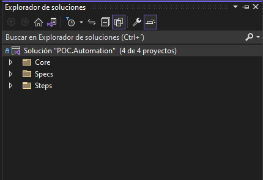

# POC.Automation.CSharp
# CSharp + Specflow + Nunit + Selenium + Appium + Reflection


This automation framework is designed under Solid principles, Design Patterns like PageObject, Singleton, Strategy, Factory Pattern and advanced programing with Reflection.
It has a different and advanced approach to the way of working with PageObject since it does not have a repository of Web actions,
 in any case it has WebElements with separate actions according to their type, such as Button.cs, Textfield.cs, Label.cs , etc

## Features
- Core
- Spec
- Steps


## Core 
Contains Helpers, and Web solutions

Helpers Solution handles Enuns, Constants and Customs Attributes like ElementAttribute, LocatorAttribute, and PageAttributes.
Example:
```cs
/// <summary>
    /// Handles class attributes for pages.
    /// </summary>
    [AttributeUsage(AttributeTargets.Class)]
    public class PageAttribute : Attribute
    {
        public string Name { get; set; }

        /// <summary>
        /// Constructors.
        /// </summary>
        /// <param name="name">Name of Attribute.</param>
        public PageAttribute(string name)
        {
            Name = name;
        }
    }
```

These attributes are used into PageObject to Create properties and Locators like Button, Textfield, etc.

Example:
```cs
 [Page("Login")] /** Custom atttribute for Class or PageObject **/
    public class Login
    {
        [Element("User Name", ElementType.TextField)] /** Custom atttribute for Locator **/
        [Locator(LocatorType.Id, "user-name")]       /** Custom atttribute for WebElement**/
        public ITexteable UserName { get; }          /** PageObject property**/

        [Element("Password", ElementType.TextField)]
        [Locator(LocatorType.Id, "password")]
        public ITexteable Password { get; }

        [Element("Login Button", ElementType.Button)]
        [Locator(LocatorType.Id, "login-button")]
        public IClickeable LoginBtn { get; }
    }
```

Attribute Page is called from Step Definition
Attribute Element is used to call a Locator from Feature file
Attribute Locator contains the basic information to instance a webElement

Example:

```sh
Given I navigate to Login
When I set '[UserName]' in User Name on Login
And I set '[Password]' in Password on Login
And I click Login Button on Login
``` 

User Name, Password, and Login Button are a WebElements into Login PageObject


## Web
Contains DriverManager, Elements, Interfaces and Pages


WebDriverManager handles a singleton to create a unique webdriver.

Elements contains Weblements Like Button, Texfields, Labels, etc

Example:

```cs
 /// <summary>
    /// Handles Textfield type element.
    /// </summary>
    public class TextField : WebElement, ITexteable
    {
        public TextField(string name, Locator locator) 
            : base(name, ElementType.TextField, locator)
        {
        }

        /// <summary>
        /// Gets text.
        /// </summary>
        /// <returns>String value.</returns>
        public string GetText()
        {
           return Element.Text;
        }

        /// <summary>
        /// Sets text
        /// </summary>
        /// <param name="text">Text to set.</param>
        public void SetText(string text)
        {
            Element.Clear();
            Element.SendKeys(text);
        }
    }
```

## Interface
Every Element implement a contract(Interface) like IClickeable, ITexteable, etc
Example:
```cs
  public interface ITexteable
    {
        void SetText(string text);
        string GetText();
    }
```


## Pages
Contains Page Objects like Login, Home, etc

Example:
```cs
 [Page("Login")]
    public class Login
    {
        [Element("UserName", ElementType.TextField)]
        [Locator(LocatorType.Id, "user-name")]
        public ITexteable UserName { get; }

        [Element("Password", ElementType.TextField)]
        [Locator(LocatorType.Id, "password")]
        public ITexteable Password { get; }

        [Element("Login", ElementType.Button)]    
        [Locator(LocatorType.Id, "login-button")] 
        public IClickeable LoginBtn { get; }
    }

```


# Steps Solution
Handles Steps definition that interact with Feature file, pages and helpers.
It use Reflection as a factory pattern to find a Page Object and then gets webelements,
it find pageObject using the Page attribute value, and use the Element attribute to get and 
instance a new Element(WebElement) in realtime execution.

Examples:
```cs
        [StepDefinition(@"I click ([^']+?)(?: on ([^']+?)|)")]
        public void Click(string elementName, string PageName)
        {
            IClickeable clickeable = (IClickeable) FactoryElement(elementName, PageName);
            clickeable.Click();
        }

        [StepDefinition(@"I set '([^']+?)' in ([^']+?)(?: on ([^']+?)|)")]
        public void SetText(string text, string elementName, string PageName)
        {
            ITexteable texteable = (ITexteable) FactoryElement(elementName, PageName);
            texteable.SetText(text);
        }

```

BaseSteps.cs

```cs
  /// <summary>
        /// Gets Element from Page class.
        /// </summary>
        /// <param name="elementName">Element name.</param>
        /// <param name="PageName">Page name.</param>
        /// <returns>Instance of any Element.</returns>
        protected dynamic FactoryElement(string elementName, string PageName)
        {
            // get class or page
            var pageClassType = GetPageClassType(PageName);
            // get elemenent or property
            PropertyInfo elementInfo = pageClassType.GetTypeInfo().GetProperties()
                .Where(property => property.GetCustomAttribute<ElementAttribute>().Name == elementName)
                .FirstOrDefault();
            
            // get locator type
            ElementType elementType = elementInfo.GetCustomAttribute<ElementAttribute>().Type;

            // build element assembly path
            string elementClass = string.Format(ElementTypeClassName, elementType.ToString());
            Type elementClassType = Assembly.Load(UIElementsAssemblyName).GetType(elementClass);

            // create element instance
            return Activator.CreateInstance(elementClassType, new object[] { elementName, GetLocator(elementInfo) });
        }
```


# Spec
Handles Feature files with Scenarios to automation testing and a basic config file

Feature fille
Example:
```sh
Given I navigate to Login
When I set '[UserName]' in UserName on Login
And I set '[Password]' in Password 
And I click Login
```


app.Config
```sh
<!--Mobile-->
    <add key="PlatformName" value="Android" />
    <add key="DeviceName" value="Marco" />
    <add key="PlatformVersion" value="Android 10" />
    <add key="BrowserName" value="Chrome" />
    <add key="IPDevice" value="127.0.0.1:4723" />

```